# GADS-2020-project-submission-template

## QwikLabs Completed

  
Lab 1:  Google Cloud Fundamentals: Getting Started with Cloud Marketplace

  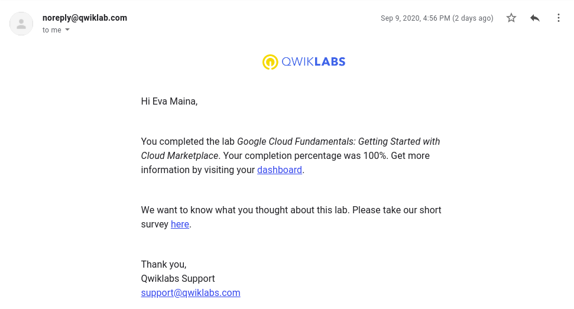

  
Lab 2:  Google Cloud Fundamentals: Getting Started with Compute Engine.

  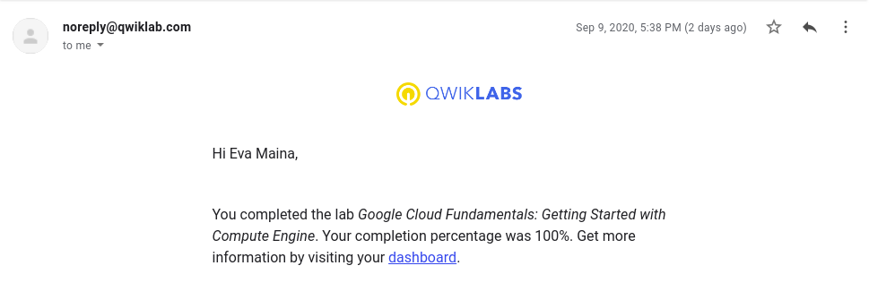

  
Lab 3:  Google Cloud Fundamentals: Getting Started with Cloud Storage and Cloud SQL.

  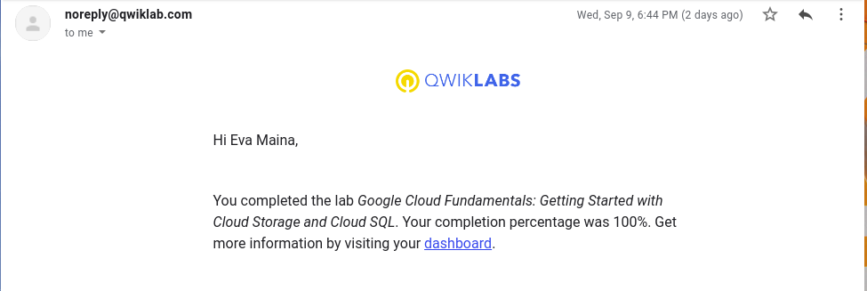

  
Lab 4:  Google Cloud Fundamentals: Getting Started with GKE.

  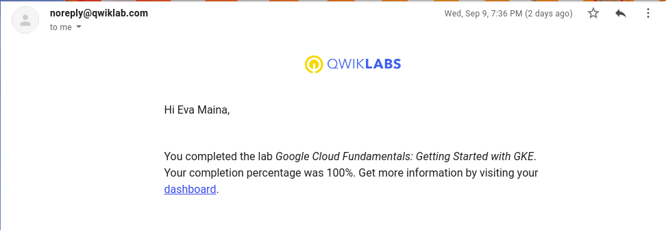

  
Lab 5:  Google Cloud Fundamentals: Getting Started with App Engine.

  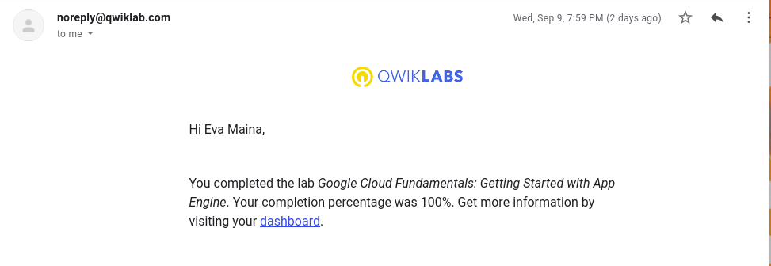

  
Lab 6:  Google Cloud Fundamentals: Getting Started with Deployment Manager and Cloud Monitoring.

  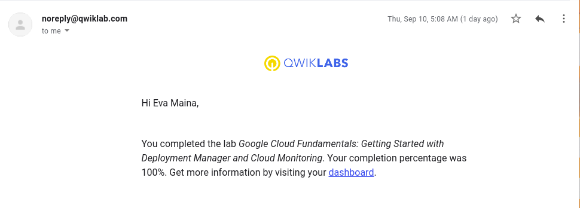

  
Lab 7:  Google Cloud Fundamentals: Getting Started with BigQuery.

  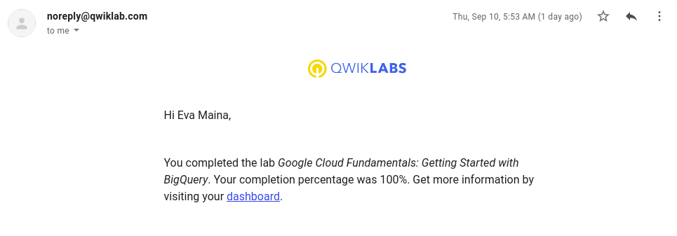

  
Lab 8:  Automating the Deployment of Infrastructure Using Terraform.

  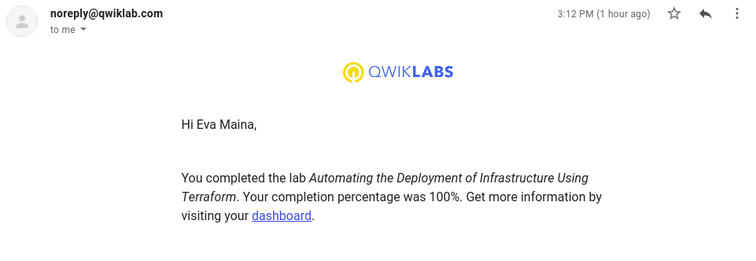

  
Lab 9:  App Dev: Storing Image and Video Files in Cloud Storage v1.1. .

  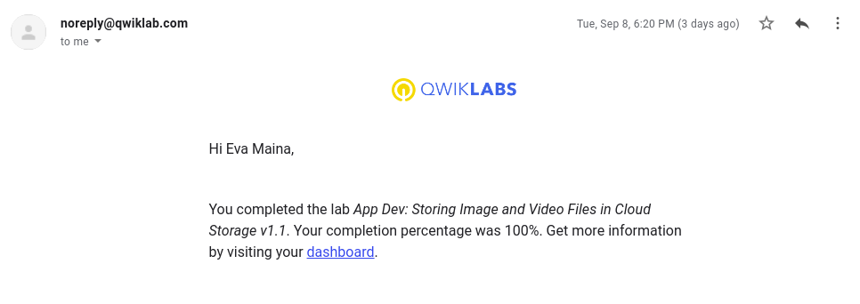

  
Lab 10:  App Dev: Storing Application Data in Cloud Datastore v1.1.

  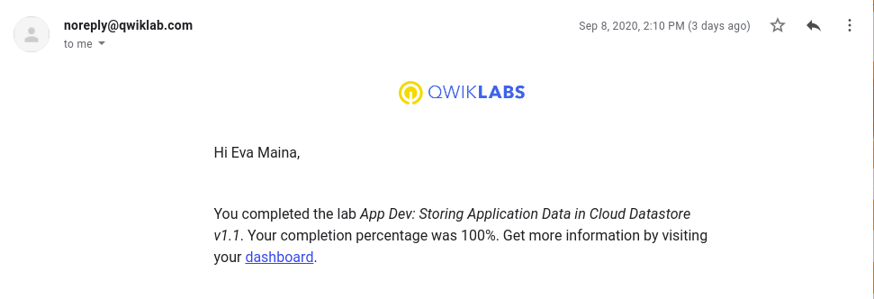

  
Lab 11:  Kubernetes Basics v1.6

  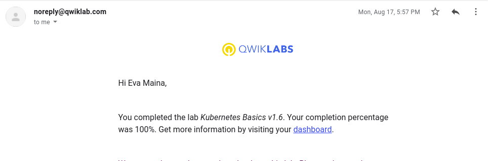

  
Lab 12:  Console and Cloud Shell

  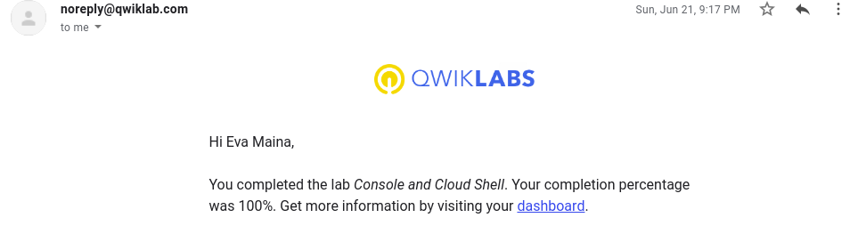

  
Lab 13:  Infrastructure Preview

  

## Translation code
